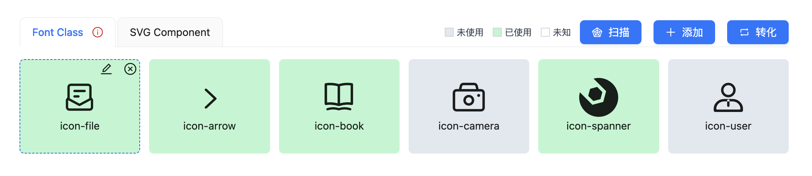
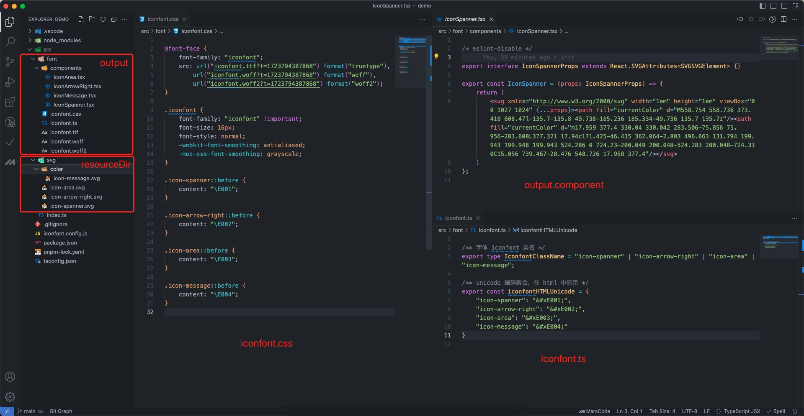

# iconfont-spanner

> 将本地 svg 文件转化为 iconfont 或 svg 组件

## 安装

```sh
npm i -D iconfont-spanner
```

## 使用

1. 根目录创建 `iconfont.config.mjs`
2. `npx iconfont` 将 `SVG` 转化为 `iconfont` 或者组件, 或
3. `npx iconfont start` 启动本地服务，访问地址将在终端显示，打开地址可对图标进行编辑删除，重新生成 `iconfont` 操作。



```sh
# 终端转化
npx iconfont
# 启动服务，网页操作，包括增删改查，查询使用情况，转化等功能
npx iconfont start [--port 8080]
```

## 功能

-   [x] svg 转化为字体(font),可配置 `ttf`, `woff`, `woff2` 中的任意几种
-   [x] svg 转化为组件，可自定义组件内容
-   [x] 本地执行 cli `npx iconfont` 转化
-   [x] 本地执行 cli `npx iconfont start` 启动本地服务
    -   [x] 添加，支持多选与文件夹拖入
    -   [x] 删除
    -   [x] 编辑名称
    -   [x] 字体(font)与 svg 实时预览
    -   [x] 扫描引用情况

## 配置说明

1. 文件名

    - commonjs: `iconfont.config.mjs`
    - ESModule: `iconfont.config.[m]js`

2. 配置内容

以下配置为全部字段，具体是否可选可参考类型定义

```javascript
import { getSvgTSReactComponentContent, toBigCamelCase } from "iconfont-spanner";

/** @type {import('iconfont-spanner').FontManagerOption} */
export default {
    resourceDir: "src/svg",
    output: {
        // 生成和字体
        font: {
            // 输出目录
            dir: "src/font",
            // 字体名称
            name: "iconfont",
            // 生成的字体格式，支持 "ttf", "woff", "woff2"
            types: ["ttf", "woff", "woff2"],
            // 格式化输出内容，type 为 "css" | "typescript"
            format: (content, type) => content, // 可以使用格式化程序处理 content
            // 自定义字体样式，会添加到 iconfont.css中，用来设定大小和颜色等，1em为继承父级的font-size
            style: fontName => {
                return `
                    font-family: "${fontName}" !important; /*默认*/
                    font-style: normal; /* 默认 */
                    -webkit-font-smoothing: antialiased; /* 默认 */
                    -moz-osx-font-smoothing: grayscale; /* 默认 */
                    font-size: 1em; /* 自定义样式 */
                `;
            },
        },
        // 转化为组件，比如 react 组件
        component: {
            // 输出目录
            dir: "src/font/components",
            // 组件文件名，需要带上文件扩展名
            fileFullName: fileName => `${toBigCamelCase(fileName)}.tsx`,
            // 组件名称
            name: fileName => toBigCamelCase(fileName),
            // 组件内容
            content: getSvgTSReactComponentContent,
            // 是否使用 currentColor 填充 svg fill 属性，如果不填充，则保留原色，可以用来实现彩色图标
            fillCurrentColor: fileName => !fileName.endsWith("_oc"),
        },
    },
    // 扫描引用情况
    scan: {
        includes: ["src/**/*.{ts,tsx,js,jsx}"],
        excludes: ["src/font/**/*", "**/*.d.ts"], // 需要明确排除的文件，这会影响到扫描结果
    },
};
```

3. 可自定义组件代码内容

    1. 内置两个 `react` 组件生成函数

        - `getSvgTSReactComponentContent`,
        - `getSvgJSReactComponentContent`

        ```tsx
        export const getSvgTSReactComponentContent = (name, svgString) => {
            return `
        /* eslint-disable */
        
        export interface ${name}Props extends React.SVGAttributes<SVGSVGElement> {}
        
        export const ${name} = (props: ${name}Props) => {
            return (
                ${svgString.replace(/<svg.+?>/gm, item => `${item.slice(0, item.length - 1)} {...props}>`)}
            )
        };
        `;
        };
        ```

    2. `vue` 组件根据自己需要自行编写，如：

        ```js
        const getSvgJSVueComponentContent = (name, svgString) => {
            return `
        <template>
        ${svgString.replace(/<svg.+?>/gm, item => `${item.slice(0, item.length - 1)} v-bind="$attrs">`)}
        </template>
        
        <script lang="ts">
        import { defineComponent } from 'vue';
        
        export default defineComponent({
            name: '${name}',
            inheritAttrs: false
        });
        </script>
        
        <style scoped>
        </style>
        `;
        };
        ```

        可以使用 [unplugin-vue-components](https://www.npmjs.com/package/unplugin-vue-components) 来实现输出组件的自动导入

        ```ts
        import { defineConfig } from "vite";
        import vue from "@vitejs/plugin-vue";
        import Components from "unplugin-vue-components/vite";

        // https://vitejs.dev/config/
        export default defineConfig({
            plugins: [
                vue(),
                Components({
                    dirs: ["src/font/components"], // <-------- 输出目录
                }),
            ],
        });
        ```

## 输出内容



## 问题

1. 在 `windows` 系统中，有时为什么会操作失败？比如修改名称，转化等功能

    如果终端显示了以下类似的错误，一般来讲，输出文件被当前项目开发服务器所引用，从而被系统锁定，无法删除也无法覆盖，这时候可以尝试关掉项目的开发服务器在尝试。

    ```log
    Error: EPERM: operation not permitted, lstat '\\?\D:\WorksCode\tianshu-web\src\assets\fonts\iconfont.ttf'
        at lstatSync (node:fs:1666:3)
        at rimrafSync (node:internal/fs/rimraf:180:13)
        at node:internal/fs/rimraf:253:9
        at Array.forEach (<anonymous>)
        at _rmdirSync (node:internal/fs/rimraf:250:7)
        at fixWinEPERMSync (node:internal/fs/rimraf:304:5)
        at rimrafSync (node:internal/fs/rimraf:200:14)
        at Object.rmSync (node:fs:1271:10)
        at Object.removeSync (D:\WorksCode\tianshu-web\node_modules\iconfont-spanner\node_modules\fs-extra\lib\remove\index.js:11:6)
        at file:///D:/WorksCode/tianshu-web/node_modules/iconfont-spanner/out/server/router.js:32:12

    ```
